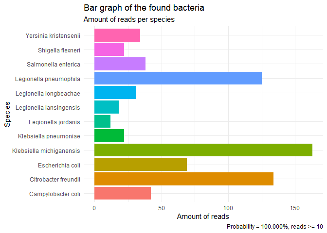

# blast\_graph

The purpose of the blast\_graph function is to easily create a graph
displaying the species in your BLAST+ output file.

``` r
library(funkyfigs)
blast_graph("../sample_example.txt", 10)
```

    ## 
    ## -- Column specification --------------------------------------------------------
    ## cols(
    ##   X1 = col_character(),
    ##   X2 = col_double(),
    ##   X3 = col_character()
    ## )

<!-- -->
