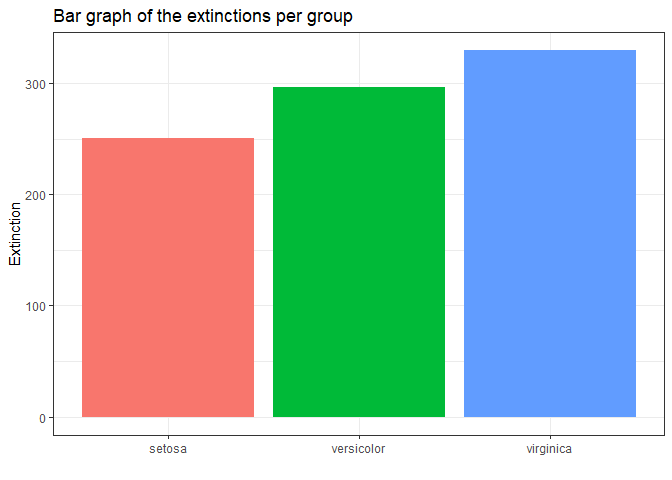

# blast\_graph

The purpose of the blast\_graph function is to easily create a graph
displaying the species in your BLAST+ output file.

``` r
library(funkyfigs)
blast_graph("data/sample_example.txt", 10)
```

    ## 
    ## -- Column specification --------------------------------------------------------
    ## cols(
    ##   X1 = col_character(),
    ##   X2 = col_double(),
    ##   X3 = col_character()
    ## )

<!-- -->

# spectophotography\_boxplot

The spectrophoto\_boxplot function makes it easier to quickly generate a
boxplot on your spectrophotography data. Note: for the example, no
actual spectophotography data was used. It’s just an example of what the
output should look like.

``` r
library(funkyfigs)
spectrophoto_boxplot(iris, iris$Species, iris$Sepal.Length)
```

<!-- -->

# spectrophoto\_bar

The spectrophoto\_bar function easily gives an overview of your
spectrophotography measurements, per group. Note: for the example, no
actual spectophotography data was used. It’s just an example of what the
output should look like.

``` r
library(funkyfigs)
spectrophoto_bar(iris, iris$Species, iris$Sepal.Length)
```

<!-- -->

# url\_table

Want to add some urls to your dataset, but it’s too much of a hassle to
put it per cell? url\_table easily adds a column with the desired urls,
per cell!

``` r
library(funkyfigs)
url_table(iris, iris$Species, urls = c(rep(c("https://en.wikipedia.org/wiki/Iris_setosa"), times = 50), rep(c("https://en.wikipedia.org/wiki/Iris_versicolor"), times = 50), rep(c("https://en.wikipedia.org/wiki/Iris_virginica"), times = 50)))
```

<table class="table table-hover" style="width: auto !important; margin-left: auto; margin-right: auto;">
<thead>
<tr>
<th style="text-align:right;">
Sepal.Length
</th>
<th style="text-align:right;">
Sepal.Width
</th>
<th style="text-align:right;">
Petal.Length
</th>
<th style="text-align:right;">
Petal.Width
</th>
<th style="text-align:left;">
Species
</th>
<th style="text-align:left;">
Links
</th>
</tr>
</thead>
<tbody>
<tr>
<td style="text-align:right;">
5.1
</td>
<td style="text-align:right;">
3.5
</td>
<td style="text-align:right;">
1.4
</td>
<td style="text-align:right;">
0.2
</td>
<td style="text-align:left;">
setosa
</td>
<td style="text-align:left;">
<a href="https://en.wikipedia.org/wiki/Iris_setosa" style="     ">setosa</a>
</td>
</tr>
<tr>
<td style="text-align:right;">
4.9
</td>
<td style="text-align:right;">
3.0
</td>
<td style="text-align:right;">
1.4
</td>
<td style="text-align:right;">
0.2
</td>
<td style="text-align:left;">
setosa
</td>
<td style="text-align:left;">
<a href="https://en.wikipedia.org/wiki/Iris_setosa" style="     ">setosa</a>
</td>
</tr>
<tr>
<td style="text-align:right;">
4.7
</td>
<td style="text-align:right;">
3.2
</td>
<td style="text-align:right;">
1.3
</td>
<td style="text-align:right;">
0.2
</td>
<td style="text-align:left;">
setosa
</td>
<td style="text-align:left;">
<a href="https://en.wikipedia.org/wiki/Iris_setosa" style="     ">setosa</a>
</td>
</tr>
<tr>
<td style="text-align:right;">
4.6
</td>
<td style="text-align:right;">
3.1
</td>
<td style="text-align:right;">
1.5
</td>
<td style="text-align:right;">
0.2
</td>
<td style="text-align:left;">
setosa
</td>
<td style="text-align:left;">
<a href="https://en.wikipedia.org/wiki/Iris_setosa" style="     ">setosa</a>
</td>
</tr>
<tr>
<td style="text-align:right;">
5.0
</td>
<td style="text-align:right;">
3.6
</td>
<td style="text-align:right;">
1.4
</td>
<td style="text-align:right;">
0.2
</td>
<td style="text-align:left;">
setosa
</td>
<td style="text-align:left;">
<a href="https://en.wikipedia.org/wiki/Iris_setosa" style="     ">setosa</a>
</td>
</tr>
<tr>
<td style="text-align:right;">
5.4
</td>
<td style="text-align:right;">
3.9
</td>
<td style="text-align:right;">
1.7
</td>
<td style="text-align:right;">
0.4
</td>
<td style="text-align:left;">
setosa
</td>
<td style="text-align:left;">
<a href="https://en.wikipedia.org/wiki/Iris_setosa" style="     ">setosa</a>
</td>
</tr>
<tr>
<td style="text-align:right;">
4.6
</td>
<td style="text-align:right;">
3.4
</td>
<td style="text-align:right;">
1.4
</td>
<td style="text-align:right;">
0.3
</td>
<td style="text-align:left;">
setosa
</td>
<td style="text-align:left;">
<a href="https://en.wikipedia.org/wiki/Iris_setosa" style="     ">setosa</a>
</td>
</tr>
<tr>
<td style="text-align:right;">
5.0
</td>
<td style="text-align:right;">
3.4
</td>
<td style="text-align:right;">
1.5
</td>
<td style="text-align:right;">
0.2
</td>
<td style="text-align:left;">
setosa
</td>
<td style="text-align:left;">
<a href="https://en.wikipedia.org/wiki/Iris_setosa" style="     ">setosa</a>
</td>
</tr>
<tr>
<td style="text-align:right;">
4.4
</td>
<td style="text-align:right;">
2.9
</td>
<td style="text-align:right;">
1.4
</td>
<td style="text-align:right;">
0.2
</td>
<td style="text-align:left;">
setosa
</td>
<td style="text-align:left;">
<a href="https://en.wikipedia.org/wiki/Iris_setosa" style="     ">setosa</a>
</td>
</tr>
<tr>
<td style="text-align:right;">
4.9
</td>
<td style="text-align:right;">
3.1
</td>
<td style="text-align:right;">
1.5
</td>
<td style="text-align:right;">
0.1
</td>
<td style="text-align:left;">
setosa
</td>
<td style="text-align:left;">
<a href="https://en.wikipedia.org/wiki/Iris_setosa" style="     ">setosa</a>
</td>
</tr>
<tr>
<td style="text-align:right;">
5.4
</td>
<td style="text-align:right;">
3.7
</td>
<td style="text-align:right;">
1.5
</td>
<td style="text-align:right;">
0.2
</td>
<td style="text-align:left;">
setosa
</td>
<td style="text-align:left;">
<a href="https://en.wikipedia.org/wiki/Iris_setosa" style="     ">setosa</a>
</td>
</tr>
<tr>
<td style="text-align:right;">
4.8
</td>
<td style="text-align:right;">
3.4
</td>
<td style="text-align:right;">
1.6
</td>
<td style="text-align:right;">
0.2
</td>
<td style="text-align:left;">
setosa
</td>
<td style="text-align:left;">
<a href="https://en.wikipedia.org/wiki/Iris_setosa" style="     ">setosa</a>
</td>
</tr>
<tr>
<td style="text-align:right;">
4.8
</td>
<td style="text-align:right;">
3.0
</td>
<td style="text-align:right;">
1.4
</td>
<td style="text-align:right;">
0.1
</td>
<td style="text-align:left;">
setosa
</td>
<td style="text-align:left;">
<a href="https://en.wikipedia.org/wiki/Iris_setosa" style="     ">setosa</a>
</td>
</tr>
<tr>
<td style="text-align:right;">
4.3
</td>
<td style="text-align:right;">
3.0
</td>
<td style="text-align:right;">
1.1
</td>
<td style="text-align:right;">
0.1
</td>
<td style="text-align:left;">
setosa
</td>
<td style="text-align:left;">
<a href="https://en.wikipedia.org/wiki/Iris_setosa" style="     ">setosa</a>
</td>
</tr>
<tr>
<td style="text-align:right;">
5.8
</td>
<td style="text-align:right;">
4.0
</td>
<td style="text-align:right;">
1.2
</td>
<td style="text-align:right;">
0.2
</td>
<td style="text-align:left;">
setosa
</td>
<td style="text-align:left;">
<a href="https://en.wikipedia.org/wiki/Iris_setosa" style="     ">setosa</a>
</td>
</tr>
<tr>
<td style="text-align:right;">
5.7
</td>
<td style="text-align:right;">
4.4
</td>
<td style="text-align:right;">
1.5
</td>
<td style="text-align:right;">
0.4
</td>
<td style="text-align:left;">
setosa
</td>
<td style="text-align:left;">
<a href="https://en.wikipedia.org/wiki/Iris_setosa" style="     ">setosa</a>
</td>
</tr>
<tr>
<td style="text-align:right;">
5.4
</td>
<td style="text-align:right;">
3.9
</td>
<td style="text-align:right;">
1.3
</td>
<td style="text-align:right;">
0.4
</td>
<td style="text-align:left;">
setosa
</td>
<td style="text-align:left;">
<a href="https://en.wikipedia.org/wiki/Iris_setosa" style="     ">setosa</a>
</td>
</tr>
<tr>
<td style="text-align:right;">
5.1
</td>
<td style="text-align:right;">
3.5
</td>
<td style="text-align:right;">
1.4
</td>
<td style="text-align:right;">
0.3
</td>
<td style="text-align:left;">
setosa
</td>
<td style="text-align:left;">
<a href="https://en.wikipedia.org/wiki/Iris_setosa" style="     ">setosa</a>
</td>
</tr>
<tr>
<td style="text-align:right;">
5.7
</td>
<td style="text-align:right;">
3.8
</td>
<td style="text-align:right;">
1.7
</td>
<td style="text-align:right;">
0.3
</td>
<td style="text-align:left;">
setosa
</td>
<td style="text-align:left;">
<a href="https://en.wikipedia.org/wiki/Iris_setosa" style="     ">setosa</a>
</td>
</tr>
<tr>
<td style="text-align:right;">
5.1
</td>
<td style="text-align:right;">
3.8
</td>
<td style="text-align:right;">
1.5
</td>
<td style="text-align:right;">
0.3
</td>
<td style="text-align:left;">
setosa
</td>
<td style="text-align:left;">
<a href="https://en.wikipedia.org/wiki/Iris_setosa" style="     ">setosa</a>
</td>
</tr>
<tr>
<td style="text-align:right;">
5.4
</td>
<td style="text-align:right;">
3.4
</td>
<td style="text-align:right;">
1.7
</td>
<td style="text-align:right;">
0.2
</td>
<td style="text-align:left;">
setosa
</td>
<td style="text-align:left;">
<a href="https://en.wikipedia.org/wiki/Iris_setosa" style="     ">setosa</a>
</td>
</tr>
<tr>
<td style="text-align:right;">
5.1
</td>
<td style="text-align:right;">
3.7
</td>
<td style="text-align:right;">
1.5
</td>
<td style="text-align:right;">
0.4
</td>
<td style="text-align:left;">
setosa
</td>
<td style="text-align:left;">
<a href="https://en.wikipedia.org/wiki/Iris_setosa" style="     ">setosa</a>
</td>
</tr>
<tr>
<td style="text-align:right;">
4.6
</td>
<td style="text-align:right;">
3.6
</td>
<td style="text-align:right;">
1.0
</td>
<td style="text-align:right;">
0.2
</td>
<td style="text-align:left;">
setosa
</td>
<td style="text-align:left;">
<a href="https://en.wikipedia.org/wiki/Iris_setosa" style="     ">setosa</a>
</td>
</tr>
<tr>
<td style="text-align:right;">
5.1
</td>
<td style="text-align:right;">
3.3
</td>
<td style="text-align:right;">
1.7
</td>
<td style="text-align:right;">
0.5
</td>
<td style="text-align:left;">
setosa
</td>
<td style="text-align:left;">
<a href="https://en.wikipedia.org/wiki/Iris_setosa" style="     ">setosa</a>
</td>
</tr>
<tr>
<td style="text-align:right;">
4.8
</td>
<td style="text-align:right;">
3.4
</td>
<td style="text-align:right;">
1.9
</td>
<td style="text-align:right;">
0.2
</td>
<td style="text-align:left;">
setosa
</td>
<td style="text-align:left;">
<a href="https://en.wikipedia.org/wiki/Iris_setosa" style="     ">setosa</a>
</td>
</tr>
<tr>
<td style="text-align:right;">
5.0
</td>
<td style="text-align:right;">
3.0
</td>
<td style="text-align:right;">
1.6
</td>
<td style="text-align:right;">
0.2
</td>
<td style="text-align:left;">
setosa
</td>
<td style="text-align:left;">
<a href="https://en.wikipedia.org/wiki/Iris_setosa" style="     ">setosa</a>
</td>
</tr>
<tr>
<td style="text-align:right;">
5.0
</td>
<td style="text-align:right;">
3.4
</td>
<td style="text-align:right;">
1.6
</td>
<td style="text-align:right;">
0.4
</td>
<td style="text-align:left;">
setosa
</td>
<td style="text-align:left;">
<a href="https://en.wikipedia.org/wiki/Iris_setosa" style="     ">setosa</a>
</td>
</tr>
<tr>
<td style="text-align:right;">
5.2
</td>
<td style="text-align:right;">
3.5
</td>
<td style="text-align:right;">
1.5
</td>
<td style="text-align:right;">
0.2
</td>
<td style="text-align:left;">
setosa
</td>
<td style="text-align:left;">
<a href="https://en.wikipedia.org/wiki/Iris_setosa" style="     ">setosa</a>
</td>
</tr>
<tr>
<td style="text-align:right;">
5.2
</td>
<td style="text-align:right;">
3.4
</td>
<td style="text-align:right;">
1.4
</td>
<td style="text-align:right;">
0.2
</td>
<td style="text-align:left;">
setosa
</td>
<td style="text-align:left;">
<a href="https://en.wikipedia.org/wiki/Iris_setosa" style="     ">setosa</a>
</td>
</tr>
<tr>
<td style="text-align:right;">
4.7
</td>
<td style="text-align:right;">
3.2
</td>
<td style="text-align:right;">
1.6
</td>
<td style="text-align:right;">
0.2
</td>
<td style="text-align:left;">
setosa
</td>
<td style="text-align:left;">
<a href="https://en.wikipedia.org/wiki/Iris_setosa" style="     ">setosa</a>
</td>
</tr>
<tr>
<td style="text-align:right;">
4.8
</td>
<td style="text-align:right;">
3.1
</td>
<td style="text-align:right;">
1.6
</td>
<td style="text-align:right;">
0.2
</td>
<td style="text-align:left;">
setosa
</td>
<td style="text-align:left;">
<a href="https://en.wikipedia.org/wiki/Iris_setosa" style="     ">setosa</a>
</td>
</tr>
<tr>
<td style="text-align:right;">
5.4
</td>
<td style="text-align:right;">
3.4
</td>
<td style="text-align:right;">
1.5
</td>
<td style="text-align:right;">
0.4
</td>
<td style="text-align:left;">
setosa
</td>
<td style="text-align:left;">
<a href="https://en.wikipedia.org/wiki/Iris_setosa" style="     ">setosa</a>
</td>
</tr>
<tr>
<td style="text-align:right;">
5.2
</td>
<td style="text-align:right;">
4.1
</td>
<td style="text-align:right;">
1.5
</td>
<td style="text-align:right;">
0.1
</td>
<td style="text-align:left;">
setosa
</td>
<td style="text-align:left;">
<a href="https://en.wikipedia.org/wiki/Iris_setosa" style="     ">setosa</a>
</td>
</tr>
<tr>
<td style="text-align:right;">
5.5
</td>
<td style="text-align:right;">
4.2
</td>
<td style="text-align:right;">
1.4
</td>
<td style="text-align:right;">
0.2
</td>
<td style="text-align:left;">
setosa
</td>
<td style="text-align:left;">
<a href="https://en.wikipedia.org/wiki/Iris_setosa" style="     ">setosa</a>
</td>
</tr>
<tr>
<td style="text-align:right;">
4.9
</td>
<td style="text-align:right;">
3.1
</td>
<td style="text-align:right;">
1.5
</td>
<td style="text-align:right;">
0.2
</td>
<td style="text-align:left;">
setosa
</td>
<td style="text-align:left;">
<a href="https://en.wikipedia.org/wiki/Iris_setosa" style="     ">setosa</a>
</td>
</tr>
<tr>
<td style="text-align:right;">
5.0
</td>
<td style="text-align:right;">
3.2
</td>
<td style="text-align:right;">
1.2
</td>
<td style="text-align:right;">
0.2
</td>
<td style="text-align:left;">
setosa
</td>
<td style="text-align:left;">
<a href="https://en.wikipedia.org/wiki/Iris_setosa" style="     ">setosa</a>
</td>
</tr>
<tr>
<td style="text-align:right;">
5.5
</td>
<td style="text-align:right;">
3.5
</td>
<td style="text-align:right;">
1.3
</td>
<td style="text-align:right;">
0.2
</td>
<td style="text-align:left;">
setosa
</td>
<td style="text-align:left;">
<a href="https://en.wikipedia.org/wiki/Iris_setosa" style="     ">setosa</a>
</td>
</tr>
<tr>
<td style="text-align:right;">
4.9
</td>
<td style="text-align:right;">
3.6
</td>
<td style="text-align:right;">
1.4
</td>
<td style="text-align:right;">
0.1
</td>
<td style="text-align:left;">
setosa
</td>
<td style="text-align:left;">
<a href="https://en.wikipedia.org/wiki/Iris_setosa" style="     ">setosa</a>
</td>
</tr>
<tr>
<td style="text-align:right;">
4.4
</td>
<td style="text-align:right;">
3.0
</td>
<td style="text-align:right;">
1.3
</td>
<td style="text-align:right;">
0.2
</td>
<td style="text-align:left;">
setosa
</td>
<td style="text-align:left;">
<a href="https://en.wikipedia.org/wiki/Iris_setosa" style="     ">setosa</a>
</td>
</tr>
<tr>
<td style="text-align:right;">
5.1
</td>
<td style="text-align:right;">
3.4
</td>
<td style="text-align:right;">
1.5
</td>
<td style="text-align:right;">
0.2
</td>
<td style="text-align:left;">
setosa
</td>
<td style="text-align:left;">
<a href="https://en.wikipedia.org/wiki/Iris_setosa" style="     ">setosa</a>
</td>
</tr>
<tr>
<td style="text-align:right;">
5.0
</td>
<td style="text-align:right;">
3.5
</td>
<td style="text-align:right;">
1.3
</td>
<td style="text-align:right;">
0.3
</td>
<td style="text-align:left;">
setosa
</td>
<td style="text-align:left;">
<a href="https://en.wikipedia.org/wiki/Iris_setosa" style="     ">setosa</a>
</td>
</tr>
<tr>
<td style="text-align:right;">
4.5
</td>
<td style="text-align:right;">
2.3
</td>
<td style="text-align:right;">
1.3
</td>
<td style="text-align:right;">
0.3
</td>
<td style="text-align:left;">
setosa
</td>
<td style="text-align:left;">
<a href="https://en.wikipedia.org/wiki/Iris_setosa" style="     ">setosa</a>
</td>
</tr>
<tr>
<td style="text-align:right;">
4.4
</td>
<td style="text-align:right;">
3.2
</td>
<td style="text-align:right;">
1.3
</td>
<td style="text-align:right;">
0.2
</td>
<td style="text-align:left;">
setosa
</td>
<td style="text-align:left;">
<a href="https://en.wikipedia.org/wiki/Iris_setosa" style="     ">setosa</a>
</td>
</tr>
<tr>
<td style="text-align:right;">
5.0
</td>
<td style="text-align:right;">
3.5
</td>
<td style="text-align:right;">
1.6
</td>
<td style="text-align:right;">
0.6
</td>
<td style="text-align:left;">
setosa
</td>
<td style="text-align:left;">
<a href="https://en.wikipedia.org/wiki/Iris_setosa" style="     ">setosa</a>
</td>
</tr>
<tr>
<td style="text-align:right;">
5.1
</td>
<td style="text-align:right;">
3.8
</td>
<td style="text-align:right;">
1.9
</td>
<td style="text-align:right;">
0.4
</td>
<td style="text-align:left;">
setosa
</td>
<td style="text-align:left;">
<a href="https://en.wikipedia.org/wiki/Iris_setosa" style="     ">setosa</a>
</td>
</tr>
<tr>
<td style="text-align:right;">
4.8
</td>
<td style="text-align:right;">
3.0
</td>
<td style="text-align:right;">
1.4
</td>
<td style="text-align:right;">
0.3
</td>
<td style="text-align:left;">
setosa
</td>
<td style="text-align:left;">
<a href="https://en.wikipedia.org/wiki/Iris_setosa" style="     ">setosa</a>
</td>
</tr>
<tr>
<td style="text-align:right;">
5.1
</td>
<td style="text-align:right;">
3.8
</td>
<td style="text-align:right;">
1.6
</td>
<td style="text-align:right;">
0.2
</td>
<td style="text-align:left;">
setosa
</td>
<td style="text-align:left;">
<a href="https://en.wikipedia.org/wiki/Iris_setosa" style="     ">setosa</a>
</td>
</tr>
<tr>
<td style="text-align:right;">
4.6
</td>
<td style="text-align:right;">
3.2
</td>
<td style="text-align:right;">
1.4
</td>
<td style="text-align:right;">
0.2
</td>
<td style="text-align:left;">
setosa
</td>
<td style="text-align:left;">
<a href="https://en.wikipedia.org/wiki/Iris_setosa" style="     ">setosa</a>
</td>
</tr>
<tr>
<td style="text-align:right;">
5.3
</td>
<td style="text-align:right;">
3.7
</td>
<td style="text-align:right;">
1.5
</td>
<td style="text-align:right;">
0.2
</td>
<td style="text-align:left;">
setosa
</td>
<td style="text-align:left;">
<a href="https://en.wikipedia.org/wiki/Iris_setosa" style="     ">setosa</a>
</td>
</tr>
<tr>
<td style="text-align:right;">
5.0
</td>
<td style="text-align:right;">
3.3
</td>
<td style="text-align:right;">
1.4
</td>
<td style="text-align:right;">
0.2
</td>
<td style="text-align:left;">
setosa
</td>
<td style="text-align:left;">
<a href="https://en.wikipedia.org/wiki/Iris_setosa" style="     ">setosa</a>
</td>
</tr>
<tr>
<td style="text-align:right;">
7.0
</td>
<td style="text-align:right;">
3.2
</td>
<td style="text-align:right;">
4.7
</td>
<td style="text-align:right;">
1.4
</td>
<td style="text-align:left;">
versicolor
</td>
<td style="text-align:left;">
<a href="https://en.wikipedia.org/wiki/Iris_versicolor" style="     ">versicolor</a>
</td>
</tr>
<tr>
<td style="text-align:right;">
6.4
</td>
<td style="text-align:right;">
3.2
</td>
<td style="text-align:right;">
4.5
</td>
<td style="text-align:right;">
1.5
</td>
<td style="text-align:left;">
versicolor
</td>
<td style="text-align:left;">
<a href="https://en.wikipedia.org/wiki/Iris_versicolor" style="     ">versicolor</a>
</td>
</tr>
<tr>
<td style="text-align:right;">
6.9
</td>
<td style="text-align:right;">
3.1
</td>
<td style="text-align:right;">
4.9
</td>
<td style="text-align:right;">
1.5
</td>
<td style="text-align:left;">
versicolor
</td>
<td style="text-align:left;">
<a href="https://en.wikipedia.org/wiki/Iris_versicolor" style="     ">versicolor</a>
</td>
</tr>
<tr>
<td style="text-align:right;">
5.5
</td>
<td style="text-align:right;">
2.3
</td>
<td style="text-align:right;">
4.0
</td>
<td style="text-align:right;">
1.3
</td>
<td style="text-align:left;">
versicolor
</td>
<td style="text-align:left;">
<a href="https://en.wikipedia.org/wiki/Iris_versicolor" style="     ">versicolor</a>
</td>
</tr>
<tr>
<td style="text-align:right;">
6.5
</td>
<td style="text-align:right;">
2.8
</td>
<td style="text-align:right;">
4.6
</td>
<td style="text-align:right;">
1.5
</td>
<td style="text-align:left;">
versicolor
</td>
<td style="text-align:left;">
<a href="https://en.wikipedia.org/wiki/Iris_versicolor" style="     ">versicolor</a>
</td>
</tr>
<tr>
<td style="text-align:right;">
5.7
</td>
<td style="text-align:right;">
2.8
</td>
<td style="text-align:right;">
4.5
</td>
<td style="text-align:right;">
1.3
</td>
<td style="text-align:left;">
versicolor
</td>
<td style="text-align:left;">
<a href="https://en.wikipedia.org/wiki/Iris_versicolor" style="     ">versicolor</a>
</td>
</tr>
<tr>
<td style="text-align:right;">
6.3
</td>
<td style="text-align:right;">
3.3
</td>
<td style="text-align:right;">
4.7
</td>
<td style="text-align:right;">
1.6
</td>
<td style="text-align:left;">
versicolor
</td>
<td style="text-align:left;">
<a href="https://en.wikipedia.org/wiki/Iris_versicolor" style="     ">versicolor</a>
</td>
</tr>
<tr>
<td style="text-align:right;">
4.9
</td>
<td style="text-align:right;">
2.4
</td>
<td style="text-align:right;">
3.3
</td>
<td style="text-align:right;">
1.0
</td>
<td style="text-align:left;">
versicolor
</td>
<td style="text-align:left;">
<a href="https://en.wikipedia.org/wiki/Iris_versicolor" style="     ">versicolor</a>
</td>
</tr>
<tr>
<td style="text-align:right;">
6.6
</td>
<td style="text-align:right;">
2.9
</td>
<td style="text-align:right;">
4.6
</td>
<td style="text-align:right;">
1.3
</td>
<td style="text-align:left;">
versicolor
</td>
<td style="text-align:left;">
<a href="https://en.wikipedia.org/wiki/Iris_versicolor" style="     ">versicolor</a>
</td>
</tr>
<tr>
<td style="text-align:right;">
5.2
</td>
<td style="text-align:right;">
2.7
</td>
<td style="text-align:right;">
3.9
</td>
<td style="text-align:right;">
1.4
</td>
<td style="text-align:left;">
versicolor
</td>
<td style="text-align:left;">
<a href="https://en.wikipedia.org/wiki/Iris_versicolor" style="     ">versicolor</a>
</td>
</tr>
<tr>
<td style="text-align:right;">
5.0
</td>
<td style="text-align:right;">
2.0
</td>
<td style="text-align:right;">
3.5
</td>
<td style="text-align:right;">
1.0
</td>
<td style="text-align:left;">
versicolor
</td>
<td style="text-align:left;">
<a href="https://en.wikipedia.org/wiki/Iris_versicolor" style="     ">versicolor</a>
</td>
</tr>
<tr>
<td style="text-align:right;">
5.9
</td>
<td style="text-align:right;">
3.0
</td>
<td style="text-align:right;">
4.2
</td>
<td style="text-align:right;">
1.5
</td>
<td style="text-align:left;">
versicolor
</td>
<td style="text-align:left;">
<a href="https://en.wikipedia.org/wiki/Iris_versicolor" style="     ">versicolor</a>
</td>
</tr>
<tr>
<td style="text-align:right;">
6.0
</td>
<td style="text-align:right;">
2.2
</td>
<td style="text-align:right;">
4.0
</td>
<td style="text-align:right;">
1.0
</td>
<td style="text-align:left;">
versicolor
</td>
<td style="text-align:left;">
<a href="https://en.wikipedia.org/wiki/Iris_versicolor" style="     ">versicolor</a>
</td>
</tr>
<tr>
<td style="text-align:right;">
6.1
</td>
<td style="text-align:right;">
2.9
</td>
<td style="text-align:right;">
4.7
</td>
<td style="text-align:right;">
1.4
</td>
<td style="text-align:left;">
versicolor
</td>
<td style="text-align:left;">
<a href="https://en.wikipedia.org/wiki/Iris_versicolor" style="     ">versicolor</a>
</td>
</tr>
<tr>
<td style="text-align:right;">
5.6
</td>
<td style="text-align:right;">
2.9
</td>
<td style="text-align:right;">
3.6
</td>
<td style="text-align:right;">
1.3
</td>
<td style="text-align:left;">
versicolor
</td>
<td style="text-align:left;">
<a href="https://en.wikipedia.org/wiki/Iris_versicolor" style="     ">versicolor</a>
</td>
</tr>
<tr>
<td style="text-align:right;">
6.7
</td>
<td style="text-align:right;">
3.1
</td>
<td style="text-align:right;">
4.4
</td>
<td style="text-align:right;">
1.4
</td>
<td style="text-align:left;">
versicolor
</td>
<td style="text-align:left;">
<a href="https://en.wikipedia.org/wiki/Iris_versicolor" style="     ">versicolor</a>
</td>
</tr>
<tr>
<td style="text-align:right;">
5.6
</td>
<td style="text-align:right;">
3.0
</td>
<td style="text-align:right;">
4.5
</td>
<td style="text-align:right;">
1.5
</td>
<td style="text-align:left;">
versicolor
</td>
<td style="text-align:left;">
<a href="https://en.wikipedia.org/wiki/Iris_versicolor" style="     ">versicolor</a>
</td>
</tr>
<tr>
<td style="text-align:right;">
5.8
</td>
<td style="text-align:right;">
2.7
</td>
<td style="text-align:right;">
4.1
</td>
<td style="text-align:right;">
1.0
</td>
<td style="text-align:left;">
versicolor
</td>
<td style="text-align:left;">
<a href="https://en.wikipedia.org/wiki/Iris_versicolor" style="     ">versicolor</a>
</td>
</tr>
<tr>
<td style="text-align:right;">
6.2
</td>
<td style="text-align:right;">
2.2
</td>
<td style="text-align:right;">
4.5
</td>
<td style="text-align:right;">
1.5
</td>
<td style="text-align:left;">
versicolor
</td>
<td style="text-align:left;">
<a href="https://en.wikipedia.org/wiki/Iris_versicolor" style="     ">versicolor</a>
</td>
</tr>
<tr>
<td style="text-align:right;">
5.6
</td>
<td style="text-align:right;">
2.5
</td>
<td style="text-align:right;">
3.9
</td>
<td style="text-align:right;">
1.1
</td>
<td style="text-align:left;">
versicolor
</td>
<td style="text-align:left;">
<a href="https://en.wikipedia.org/wiki/Iris_versicolor" style="     ">versicolor</a>
</td>
</tr>
<tr>
<td style="text-align:right;">
5.9
</td>
<td style="text-align:right;">
3.2
</td>
<td style="text-align:right;">
4.8
</td>
<td style="text-align:right;">
1.8
</td>
<td style="text-align:left;">
versicolor
</td>
<td style="text-align:left;">
<a href="https://en.wikipedia.org/wiki/Iris_versicolor" style="     ">versicolor</a>
</td>
</tr>
<tr>
<td style="text-align:right;">
6.1
</td>
<td style="text-align:right;">
2.8
</td>
<td style="text-align:right;">
4.0
</td>
<td style="text-align:right;">
1.3
</td>
<td style="text-align:left;">
versicolor
</td>
<td style="text-align:left;">
<a href="https://en.wikipedia.org/wiki/Iris_versicolor" style="     ">versicolor</a>
</td>
</tr>
<tr>
<td style="text-align:right;">
6.3
</td>
<td style="text-align:right;">
2.5
</td>
<td style="text-align:right;">
4.9
</td>
<td style="text-align:right;">
1.5
</td>
<td style="text-align:left;">
versicolor
</td>
<td style="text-align:left;">
<a href="https://en.wikipedia.org/wiki/Iris_versicolor" style="     ">versicolor</a>
</td>
</tr>
<tr>
<td style="text-align:right;">
6.1
</td>
<td style="text-align:right;">
2.8
</td>
<td style="text-align:right;">
4.7
</td>
<td style="text-align:right;">
1.2
</td>
<td style="text-align:left;">
versicolor
</td>
<td style="text-align:left;">
<a href="https://en.wikipedia.org/wiki/Iris_versicolor" style="     ">versicolor</a>
</td>
</tr>
<tr>
<td style="text-align:right;">
6.4
</td>
<td style="text-align:right;">
2.9
</td>
<td style="text-align:right;">
4.3
</td>
<td style="text-align:right;">
1.3
</td>
<td style="text-align:left;">
versicolor
</td>
<td style="text-align:left;">
<a href="https://en.wikipedia.org/wiki/Iris_versicolor" style="     ">versicolor</a>
</td>
</tr>
<tr>
<td style="text-align:right;">
6.6
</td>
<td style="text-align:right;">
3.0
</td>
<td style="text-align:right;">
4.4
</td>
<td style="text-align:right;">
1.4
</td>
<td style="text-align:left;">
versicolor
</td>
<td style="text-align:left;">
<a href="https://en.wikipedia.org/wiki/Iris_versicolor" style="     ">versicolor</a>
</td>
</tr>
<tr>
<td style="text-align:right;">
6.8
</td>
<td style="text-align:right;">
2.8
</td>
<td style="text-align:right;">
4.8
</td>
<td style="text-align:right;">
1.4
</td>
<td style="text-align:left;">
versicolor
</td>
<td style="text-align:left;">
<a href="https://en.wikipedia.org/wiki/Iris_versicolor" style="     ">versicolor</a>
</td>
</tr>
<tr>
<td style="text-align:right;">
6.7
</td>
<td style="text-align:right;">
3.0
</td>
<td style="text-align:right;">
5.0
</td>
<td style="text-align:right;">
1.7
</td>
<td style="text-align:left;">
versicolor
</td>
<td style="text-align:left;">
<a href="https://en.wikipedia.org/wiki/Iris_versicolor" style="     ">versicolor</a>
</td>
</tr>
<tr>
<td style="text-align:right;">
6.0
</td>
<td style="text-align:right;">
2.9
</td>
<td style="text-align:right;">
4.5
</td>
<td style="text-align:right;">
1.5
</td>
<td style="text-align:left;">
versicolor
</td>
<td style="text-align:left;">
<a href="https://en.wikipedia.org/wiki/Iris_versicolor" style="     ">versicolor</a>
</td>
</tr>
<tr>
<td style="text-align:right;">
5.7
</td>
<td style="text-align:right;">
2.6
</td>
<td style="text-align:right;">
3.5
</td>
<td style="text-align:right;">
1.0
</td>
<td style="text-align:left;">
versicolor
</td>
<td style="text-align:left;">
<a href="https://en.wikipedia.org/wiki/Iris_versicolor" style="     ">versicolor</a>
</td>
</tr>
<tr>
<td style="text-align:right;">
5.5
</td>
<td style="text-align:right;">
2.4
</td>
<td style="text-align:right;">
3.8
</td>
<td style="text-align:right;">
1.1
</td>
<td style="text-align:left;">
versicolor
</td>
<td style="text-align:left;">
<a href="https://en.wikipedia.org/wiki/Iris_versicolor" style="     ">versicolor</a>
</td>
</tr>
<tr>
<td style="text-align:right;">
5.5
</td>
<td style="text-align:right;">
2.4
</td>
<td style="text-align:right;">
3.7
</td>
<td style="text-align:right;">
1.0
</td>
<td style="text-align:left;">
versicolor
</td>
<td style="text-align:left;">
<a href="https://en.wikipedia.org/wiki/Iris_versicolor" style="     ">versicolor</a>
</td>
</tr>
<tr>
<td style="text-align:right;">
5.8
</td>
<td style="text-align:right;">
2.7
</td>
<td style="text-align:right;">
3.9
</td>
<td style="text-align:right;">
1.2
</td>
<td style="text-align:left;">
versicolor
</td>
<td style="text-align:left;">
<a href="https://en.wikipedia.org/wiki/Iris_versicolor" style="     ">versicolor</a>
</td>
</tr>
<tr>
<td style="text-align:right;">
6.0
</td>
<td style="text-align:right;">
2.7
</td>
<td style="text-align:right;">
5.1
</td>
<td style="text-align:right;">
1.6
</td>
<td style="text-align:left;">
versicolor
</td>
<td style="text-align:left;">
<a href="https://en.wikipedia.org/wiki/Iris_versicolor" style="     ">versicolor</a>
</td>
</tr>
<tr>
<td style="text-align:right;">
5.4
</td>
<td style="text-align:right;">
3.0
</td>
<td style="text-align:right;">
4.5
</td>
<td style="text-align:right;">
1.5
</td>
<td style="text-align:left;">
versicolor
</td>
<td style="text-align:left;">
<a href="https://en.wikipedia.org/wiki/Iris_versicolor" style="     ">versicolor</a>
</td>
</tr>
<tr>
<td style="text-align:right;">
6.0
</td>
<td style="text-align:right;">
3.4
</td>
<td style="text-align:right;">
4.5
</td>
<td style="text-align:right;">
1.6
</td>
<td style="text-align:left;">
versicolor
</td>
<td style="text-align:left;">
<a href="https://en.wikipedia.org/wiki/Iris_versicolor" style="     ">versicolor</a>
</td>
</tr>
<tr>
<td style="text-align:right;">
6.7
</td>
<td style="text-align:right;">
3.1
</td>
<td style="text-align:right;">
4.7
</td>
<td style="text-align:right;">
1.5
</td>
<td style="text-align:left;">
versicolor
</td>
<td style="text-align:left;">
<a href="https://en.wikipedia.org/wiki/Iris_versicolor" style="     ">versicolor</a>
</td>
</tr>
<tr>
<td style="text-align:right;">
6.3
</td>
<td style="text-align:right;">
2.3
</td>
<td style="text-align:right;">
4.4
</td>
<td style="text-align:right;">
1.3
</td>
<td style="text-align:left;">
versicolor
</td>
<td style="text-align:left;">
<a href="https://en.wikipedia.org/wiki/Iris_versicolor" style="     ">versicolor</a>
</td>
</tr>
<tr>
<td style="text-align:right;">
5.6
</td>
<td style="text-align:right;">
3.0
</td>
<td style="text-align:right;">
4.1
</td>
<td style="text-align:right;">
1.3
</td>
<td style="text-align:left;">
versicolor
</td>
<td style="text-align:left;">
<a href="https://en.wikipedia.org/wiki/Iris_versicolor" style="     ">versicolor</a>
</td>
</tr>
<tr>
<td style="text-align:right;">
5.5
</td>
<td style="text-align:right;">
2.5
</td>
<td style="text-align:right;">
4.0
</td>
<td style="text-align:right;">
1.3
</td>
<td style="text-align:left;">
versicolor
</td>
<td style="text-align:left;">
<a href="https://en.wikipedia.org/wiki/Iris_versicolor" style="     ">versicolor</a>
</td>
</tr>
<tr>
<td style="text-align:right;">
5.5
</td>
<td style="text-align:right;">
2.6
</td>
<td style="text-align:right;">
4.4
</td>
<td style="text-align:right;">
1.2
</td>
<td style="text-align:left;">
versicolor
</td>
<td style="text-align:left;">
<a href="https://en.wikipedia.org/wiki/Iris_versicolor" style="     ">versicolor</a>
</td>
</tr>
<tr>
<td style="text-align:right;">
6.1
</td>
<td style="text-align:right;">
3.0
</td>
<td style="text-align:right;">
4.6
</td>
<td style="text-align:right;">
1.4
</td>
<td style="text-align:left;">
versicolor
</td>
<td style="text-align:left;">
<a href="https://en.wikipedia.org/wiki/Iris_versicolor" style="     ">versicolor</a>
</td>
</tr>
<tr>
<td style="text-align:right;">
5.8
</td>
<td style="text-align:right;">
2.6
</td>
<td style="text-align:right;">
4.0
</td>
<td style="text-align:right;">
1.2
</td>
<td style="text-align:left;">
versicolor
</td>
<td style="text-align:left;">
<a href="https://en.wikipedia.org/wiki/Iris_versicolor" style="     ">versicolor</a>
</td>
</tr>
<tr>
<td style="text-align:right;">
5.0
</td>
<td style="text-align:right;">
2.3
</td>
<td style="text-align:right;">
3.3
</td>
<td style="text-align:right;">
1.0
</td>
<td style="text-align:left;">
versicolor
</td>
<td style="text-align:left;">
<a href="https://en.wikipedia.org/wiki/Iris_versicolor" style="     ">versicolor</a>
</td>
</tr>
<tr>
<td style="text-align:right;">
5.6
</td>
<td style="text-align:right;">
2.7
</td>
<td style="text-align:right;">
4.2
</td>
<td style="text-align:right;">
1.3
</td>
<td style="text-align:left;">
versicolor
</td>
<td style="text-align:left;">
<a href="https://en.wikipedia.org/wiki/Iris_versicolor" style="     ">versicolor</a>
</td>
</tr>
<tr>
<td style="text-align:right;">
5.7
</td>
<td style="text-align:right;">
3.0
</td>
<td style="text-align:right;">
4.2
</td>
<td style="text-align:right;">
1.2
</td>
<td style="text-align:left;">
versicolor
</td>
<td style="text-align:left;">
<a href="https://en.wikipedia.org/wiki/Iris_versicolor" style="     ">versicolor</a>
</td>
</tr>
<tr>
<td style="text-align:right;">
5.7
</td>
<td style="text-align:right;">
2.9
</td>
<td style="text-align:right;">
4.2
</td>
<td style="text-align:right;">
1.3
</td>
<td style="text-align:left;">
versicolor
</td>
<td style="text-align:left;">
<a href="https://en.wikipedia.org/wiki/Iris_versicolor" style="     ">versicolor</a>
</td>
</tr>
<tr>
<td style="text-align:right;">
6.2
</td>
<td style="text-align:right;">
2.9
</td>
<td style="text-align:right;">
4.3
</td>
<td style="text-align:right;">
1.3
</td>
<td style="text-align:left;">
versicolor
</td>
<td style="text-align:left;">
<a href="https://en.wikipedia.org/wiki/Iris_versicolor" style="     ">versicolor</a>
</td>
</tr>
<tr>
<td style="text-align:right;">
5.1
</td>
<td style="text-align:right;">
2.5
</td>
<td style="text-align:right;">
3.0
</td>
<td style="text-align:right;">
1.1
</td>
<td style="text-align:left;">
versicolor
</td>
<td style="text-align:left;">
<a href="https://en.wikipedia.org/wiki/Iris_versicolor" style="     ">versicolor</a>
</td>
</tr>
<tr>
<td style="text-align:right;">
5.7
</td>
<td style="text-align:right;">
2.8
</td>
<td style="text-align:right;">
4.1
</td>
<td style="text-align:right;">
1.3
</td>
<td style="text-align:left;">
versicolor
</td>
<td style="text-align:left;">
<a href="https://en.wikipedia.org/wiki/Iris_versicolor" style="     ">versicolor</a>
</td>
</tr>
<tr>
<td style="text-align:right;">
6.3
</td>
<td style="text-align:right;">
3.3
</td>
<td style="text-align:right;">
6.0
</td>
<td style="text-align:right;">
2.5
</td>
<td style="text-align:left;">
virginica
</td>
<td style="text-align:left;">
<a href="https://en.wikipedia.org/wiki/Iris_virginica" style="     ">virginica</a>
</td>
</tr>
<tr>
<td style="text-align:right;">
5.8
</td>
<td style="text-align:right;">
2.7
</td>
<td style="text-align:right;">
5.1
</td>
<td style="text-align:right;">
1.9
</td>
<td style="text-align:left;">
virginica
</td>
<td style="text-align:left;">
<a href="https://en.wikipedia.org/wiki/Iris_virginica" style="     ">virginica</a>
</td>
</tr>
<tr>
<td style="text-align:right;">
7.1
</td>
<td style="text-align:right;">
3.0
</td>
<td style="text-align:right;">
5.9
</td>
<td style="text-align:right;">
2.1
</td>
<td style="text-align:left;">
virginica
</td>
<td style="text-align:left;">
<a href="https://en.wikipedia.org/wiki/Iris_virginica" style="     ">virginica</a>
</td>
</tr>
<tr>
<td style="text-align:right;">
6.3
</td>
<td style="text-align:right;">
2.9
</td>
<td style="text-align:right;">
5.6
</td>
<td style="text-align:right;">
1.8
</td>
<td style="text-align:left;">
virginica
</td>
<td style="text-align:left;">
<a href="https://en.wikipedia.org/wiki/Iris_virginica" style="     ">virginica</a>
</td>
</tr>
<tr>
<td style="text-align:right;">
6.5
</td>
<td style="text-align:right;">
3.0
</td>
<td style="text-align:right;">
5.8
</td>
<td style="text-align:right;">
2.2
</td>
<td style="text-align:left;">
virginica
</td>
<td style="text-align:left;">
<a href="https://en.wikipedia.org/wiki/Iris_virginica" style="     ">virginica</a>
</td>
</tr>
<tr>
<td style="text-align:right;">
7.6
</td>
<td style="text-align:right;">
3.0
</td>
<td style="text-align:right;">
6.6
</td>
<td style="text-align:right;">
2.1
</td>
<td style="text-align:left;">
virginica
</td>
<td style="text-align:left;">
<a href="https://en.wikipedia.org/wiki/Iris_virginica" style="     ">virginica</a>
</td>
</tr>
<tr>
<td style="text-align:right;">
4.9
</td>
<td style="text-align:right;">
2.5
</td>
<td style="text-align:right;">
4.5
</td>
<td style="text-align:right;">
1.7
</td>
<td style="text-align:left;">
virginica
</td>
<td style="text-align:left;">
<a href="https://en.wikipedia.org/wiki/Iris_virginica" style="     ">virginica</a>
</td>
</tr>
<tr>
<td style="text-align:right;">
7.3
</td>
<td style="text-align:right;">
2.9
</td>
<td style="text-align:right;">
6.3
</td>
<td style="text-align:right;">
1.8
</td>
<td style="text-align:left;">
virginica
</td>
<td style="text-align:left;">
<a href="https://en.wikipedia.org/wiki/Iris_virginica" style="     ">virginica</a>
</td>
</tr>
<tr>
<td style="text-align:right;">
6.7
</td>
<td style="text-align:right;">
2.5
</td>
<td style="text-align:right;">
5.8
</td>
<td style="text-align:right;">
1.8
</td>
<td style="text-align:left;">
virginica
</td>
<td style="text-align:left;">
<a href="https://en.wikipedia.org/wiki/Iris_virginica" style="     ">virginica</a>
</td>
</tr>
<tr>
<td style="text-align:right;">
7.2
</td>
<td style="text-align:right;">
3.6
</td>
<td style="text-align:right;">
6.1
</td>
<td style="text-align:right;">
2.5
</td>
<td style="text-align:left;">
virginica
</td>
<td style="text-align:left;">
<a href="https://en.wikipedia.org/wiki/Iris_virginica" style="     ">virginica</a>
</td>
</tr>
<tr>
<td style="text-align:right;">
6.5
</td>
<td style="text-align:right;">
3.2
</td>
<td style="text-align:right;">
5.1
</td>
<td style="text-align:right;">
2.0
</td>
<td style="text-align:left;">
virginica
</td>
<td style="text-align:left;">
<a href="https://en.wikipedia.org/wiki/Iris_virginica" style="     ">virginica</a>
</td>
</tr>
<tr>
<td style="text-align:right;">
6.4
</td>
<td style="text-align:right;">
2.7
</td>
<td style="text-align:right;">
5.3
</td>
<td style="text-align:right;">
1.9
</td>
<td style="text-align:left;">
virginica
</td>
<td style="text-align:left;">
<a href="https://en.wikipedia.org/wiki/Iris_virginica" style="     ">virginica</a>
</td>
</tr>
<tr>
<td style="text-align:right;">
6.8
</td>
<td style="text-align:right;">
3.0
</td>
<td style="text-align:right;">
5.5
</td>
<td style="text-align:right;">
2.1
</td>
<td style="text-align:left;">
virginica
</td>
<td style="text-align:left;">
<a href="https://en.wikipedia.org/wiki/Iris_virginica" style="     ">virginica</a>
</td>
</tr>
<tr>
<td style="text-align:right;">
5.7
</td>
<td style="text-align:right;">
2.5
</td>
<td style="text-align:right;">
5.0
</td>
<td style="text-align:right;">
2.0
</td>
<td style="text-align:left;">
virginica
</td>
<td style="text-align:left;">
<a href="https://en.wikipedia.org/wiki/Iris_virginica" style="     ">virginica</a>
</td>
</tr>
<tr>
<td style="text-align:right;">
5.8
</td>
<td style="text-align:right;">
2.8
</td>
<td style="text-align:right;">
5.1
</td>
<td style="text-align:right;">
2.4
</td>
<td style="text-align:left;">
virginica
</td>
<td style="text-align:left;">
<a href="https://en.wikipedia.org/wiki/Iris_virginica" style="     ">virginica</a>
</td>
</tr>
<tr>
<td style="text-align:right;">
6.4
</td>
<td style="text-align:right;">
3.2
</td>
<td style="text-align:right;">
5.3
</td>
<td style="text-align:right;">
2.3
</td>
<td style="text-align:left;">
virginica
</td>
<td style="text-align:left;">
<a href="https://en.wikipedia.org/wiki/Iris_virginica" style="     ">virginica</a>
</td>
</tr>
<tr>
<td style="text-align:right;">
6.5
</td>
<td style="text-align:right;">
3.0
</td>
<td style="text-align:right;">
5.5
</td>
<td style="text-align:right;">
1.8
</td>
<td style="text-align:left;">
virginica
</td>
<td style="text-align:left;">
<a href="https://en.wikipedia.org/wiki/Iris_virginica" style="     ">virginica</a>
</td>
</tr>
<tr>
<td style="text-align:right;">
7.7
</td>
<td style="text-align:right;">
3.8
</td>
<td style="text-align:right;">
6.7
</td>
<td style="text-align:right;">
2.2
</td>
<td style="text-align:left;">
virginica
</td>
<td style="text-align:left;">
<a href="https://en.wikipedia.org/wiki/Iris_virginica" style="     ">virginica</a>
</td>
</tr>
<tr>
<td style="text-align:right;">
7.7
</td>
<td style="text-align:right;">
2.6
</td>
<td style="text-align:right;">
6.9
</td>
<td style="text-align:right;">
2.3
</td>
<td style="text-align:left;">
virginica
</td>
<td style="text-align:left;">
<a href="https://en.wikipedia.org/wiki/Iris_virginica" style="     ">virginica</a>
</td>
</tr>
<tr>
<td style="text-align:right;">
6.0
</td>
<td style="text-align:right;">
2.2
</td>
<td style="text-align:right;">
5.0
</td>
<td style="text-align:right;">
1.5
</td>
<td style="text-align:left;">
virginica
</td>
<td style="text-align:left;">
<a href="https://en.wikipedia.org/wiki/Iris_virginica" style="     ">virginica</a>
</td>
</tr>
<tr>
<td style="text-align:right;">
6.9
</td>
<td style="text-align:right;">
3.2
</td>
<td style="text-align:right;">
5.7
</td>
<td style="text-align:right;">
2.3
</td>
<td style="text-align:left;">
virginica
</td>
<td style="text-align:left;">
<a href="https://en.wikipedia.org/wiki/Iris_virginica" style="     ">virginica</a>
</td>
</tr>
<tr>
<td style="text-align:right;">
5.6
</td>
<td style="text-align:right;">
2.8
</td>
<td style="text-align:right;">
4.9
</td>
<td style="text-align:right;">
2.0
</td>
<td style="text-align:left;">
virginica
</td>
<td style="text-align:left;">
<a href="https://en.wikipedia.org/wiki/Iris_virginica" style="     ">virginica</a>
</td>
</tr>
<tr>
<td style="text-align:right;">
7.7
</td>
<td style="text-align:right;">
2.8
</td>
<td style="text-align:right;">
6.7
</td>
<td style="text-align:right;">
2.0
</td>
<td style="text-align:left;">
virginica
</td>
<td style="text-align:left;">
<a href="https://en.wikipedia.org/wiki/Iris_virginica" style="     ">virginica</a>
</td>
</tr>
<tr>
<td style="text-align:right;">
6.3
</td>
<td style="text-align:right;">
2.7
</td>
<td style="text-align:right;">
4.9
</td>
<td style="text-align:right;">
1.8
</td>
<td style="text-align:left;">
virginica
</td>
<td style="text-align:left;">
<a href="https://en.wikipedia.org/wiki/Iris_virginica" style="     ">virginica</a>
</td>
</tr>
<tr>
<td style="text-align:right;">
6.7
</td>
<td style="text-align:right;">
3.3
</td>
<td style="text-align:right;">
5.7
</td>
<td style="text-align:right;">
2.1
</td>
<td style="text-align:left;">
virginica
</td>
<td style="text-align:left;">
<a href="https://en.wikipedia.org/wiki/Iris_virginica" style="     ">virginica</a>
</td>
</tr>
<tr>
<td style="text-align:right;">
7.2
</td>
<td style="text-align:right;">
3.2
</td>
<td style="text-align:right;">
6.0
</td>
<td style="text-align:right;">
1.8
</td>
<td style="text-align:left;">
virginica
</td>
<td style="text-align:left;">
<a href="https://en.wikipedia.org/wiki/Iris_virginica" style="     ">virginica</a>
</td>
</tr>
<tr>
<td style="text-align:right;">
6.2
</td>
<td style="text-align:right;">
2.8
</td>
<td style="text-align:right;">
4.8
</td>
<td style="text-align:right;">
1.8
</td>
<td style="text-align:left;">
virginica
</td>
<td style="text-align:left;">
<a href="https://en.wikipedia.org/wiki/Iris_virginica" style="     ">virginica</a>
</td>
</tr>
<tr>
<td style="text-align:right;">
6.1
</td>
<td style="text-align:right;">
3.0
</td>
<td style="text-align:right;">
4.9
</td>
<td style="text-align:right;">
1.8
</td>
<td style="text-align:left;">
virginica
</td>
<td style="text-align:left;">
<a href="https://en.wikipedia.org/wiki/Iris_virginica" style="     ">virginica</a>
</td>
</tr>
<tr>
<td style="text-align:right;">
6.4
</td>
<td style="text-align:right;">
2.8
</td>
<td style="text-align:right;">
5.6
</td>
<td style="text-align:right;">
2.1
</td>
<td style="text-align:left;">
virginica
</td>
<td style="text-align:left;">
<a href="https://en.wikipedia.org/wiki/Iris_virginica" style="     ">virginica</a>
</td>
</tr>
<tr>
<td style="text-align:right;">
7.2
</td>
<td style="text-align:right;">
3.0
</td>
<td style="text-align:right;">
5.8
</td>
<td style="text-align:right;">
1.6
</td>
<td style="text-align:left;">
virginica
</td>
<td style="text-align:left;">
<a href="https://en.wikipedia.org/wiki/Iris_virginica" style="     ">virginica</a>
</td>
</tr>
<tr>
<td style="text-align:right;">
7.4
</td>
<td style="text-align:right;">
2.8
</td>
<td style="text-align:right;">
6.1
</td>
<td style="text-align:right;">
1.9
</td>
<td style="text-align:left;">
virginica
</td>
<td style="text-align:left;">
<a href="https://en.wikipedia.org/wiki/Iris_virginica" style="     ">virginica</a>
</td>
</tr>
<tr>
<td style="text-align:right;">
7.9
</td>
<td style="text-align:right;">
3.8
</td>
<td style="text-align:right;">
6.4
</td>
<td style="text-align:right;">
2.0
</td>
<td style="text-align:left;">
virginica
</td>
<td style="text-align:left;">
<a href="https://en.wikipedia.org/wiki/Iris_virginica" style="     ">virginica</a>
</td>
</tr>
<tr>
<td style="text-align:right;">
6.4
</td>
<td style="text-align:right;">
2.8
</td>
<td style="text-align:right;">
5.6
</td>
<td style="text-align:right;">
2.2
</td>
<td style="text-align:left;">
virginica
</td>
<td style="text-align:left;">
<a href="https://en.wikipedia.org/wiki/Iris_virginica" style="     ">virginica</a>
</td>
</tr>
<tr>
<td style="text-align:right;">
6.3
</td>
<td style="text-align:right;">
2.8
</td>
<td style="text-align:right;">
5.1
</td>
<td style="text-align:right;">
1.5
</td>
<td style="text-align:left;">
virginica
</td>
<td style="text-align:left;">
<a href="https://en.wikipedia.org/wiki/Iris_virginica" style="     ">virginica</a>
</td>
</tr>
<tr>
<td style="text-align:right;">
6.1
</td>
<td style="text-align:right;">
2.6
</td>
<td style="text-align:right;">
5.6
</td>
<td style="text-align:right;">
1.4
</td>
<td style="text-align:left;">
virginica
</td>
<td style="text-align:left;">
<a href="https://en.wikipedia.org/wiki/Iris_virginica" style="     ">virginica</a>
</td>
</tr>
<tr>
<td style="text-align:right;">
7.7
</td>
<td style="text-align:right;">
3.0
</td>
<td style="text-align:right;">
6.1
</td>
<td style="text-align:right;">
2.3
</td>
<td style="text-align:left;">
virginica
</td>
<td style="text-align:left;">
<a href="https://en.wikipedia.org/wiki/Iris_virginica" style="     ">virginica</a>
</td>
</tr>
<tr>
<td style="text-align:right;">
6.3
</td>
<td style="text-align:right;">
3.4
</td>
<td style="text-align:right;">
5.6
</td>
<td style="text-align:right;">
2.4
</td>
<td style="text-align:left;">
virginica
</td>
<td style="text-align:left;">
<a href="https://en.wikipedia.org/wiki/Iris_virginica" style="     ">virginica</a>
</td>
</tr>
<tr>
<td style="text-align:right;">
6.4
</td>
<td style="text-align:right;">
3.1
</td>
<td style="text-align:right;">
5.5
</td>
<td style="text-align:right;">
1.8
</td>
<td style="text-align:left;">
virginica
</td>
<td style="text-align:left;">
<a href="https://en.wikipedia.org/wiki/Iris_virginica" style="     ">virginica</a>
</td>
</tr>
<tr>
<td style="text-align:right;">
6.0
</td>
<td style="text-align:right;">
3.0
</td>
<td style="text-align:right;">
4.8
</td>
<td style="text-align:right;">
1.8
</td>
<td style="text-align:left;">
virginica
</td>
<td style="text-align:left;">
<a href="https://en.wikipedia.org/wiki/Iris_virginica" style="     ">virginica</a>
</td>
</tr>
<tr>
<td style="text-align:right;">
6.9
</td>
<td style="text-align:right;">
3.1
</td>
<td style="text-align:right;">
5.4
</td>
<td style="text-align:right;">
2.1
</td>
<td style="text-align:left;">
virginica
</td>
<td style="text-align:left;">
<a href="https://en.wikipedia.org/wiki/Iris_virginica" style="     ">virginica</a>
</td>
</tr>
<tr>
<td style="text-align:right;">
6.7
</td>
<td style="text-align:right;">
3.1
</td>
<td style="text-align:right;">
5.6
</td>
<td style="text-align:right;">
2.4
</td>
<td style="text-align:left;">
virginica
</td>
<td style="text-align:left;">
<a href="https://en.wikipedia.org/wiki/Iris_virginica" style="     ">virginica</a>
</td>
</tr>
<tr>
<td style="text-align:right;">
6.9
</td>
<td style="text-align:right;">
3.1
</td>
<td style="text-align:right;">
5.1
</td>
<td style="text-align:right;">
2.3
</td>
<td style="text-align:left;">
virginica
</td>
<td style="text-align:left;">
<a href="https://en.wikipedia.org/wiki/Iris_virginica" style="     ">virginica</a>
</td>
</tr>
<tr>
<td style="text-align:right;">
5.8
</td>
<td style="text-align:right;">
2.7
</td>
<td style="text-align:right;">
5.1
</td>
<td style="text-align:right;">
1.9
</td>
<td style="text-align:left;">
virginica
</td>
<td style="text-align:left;">
<a href="https://en.wikipedia.org/wiki/Iris_virginica" style="     ">virginica</a>
</td>
</tr>
<tr>
<td style="text-align:right;">
6.8
</td>
<td style="text-align:right;">
3.2
</td>
<td style="text-align:right;">
5.9
</td>
<td style="text-align:right;">
2.3
</td>
<td style="text-align:left;">
virginica
</td>
<td style="text-align:left;">
<a href="https://en.wikipedia.org/wiki/Iris_virginica" style="     ">virginica</a>
</td>
</tr>
<tr>
<td style="text-align:right;">
6.7
</td>
<td style="text-align:right;">
3.3
</td>
<td style="text-align:right;">
5.7
</td>
<td style="text-align:right;">
2.5
</td>
<td style="text-align:left;">
virginica
</td>
<td style="text-align:left;">
<a href="https://en.wikipedia.org/wiki/Iris_virginica" style="     ">virginica</a>
</td>
</tr>
<tr>
<td style="text-align:right;">
6.7
</td>
<td style="text-align:right;">
3.0
</td>
<td style="text-align:right;">
5.2
</td>
<td style="text-align:right;">
2.3
</td>
<td style="text-align:left;">
virginica
</td>
<td style="text-align:left;">
<a href="https://en.wikipedia.org/wiki/Iris_virginica" style="     ">virginica</a>
</td>
</tr>
<tr>
<td style="text-align:right;">
6.3
</td>
<td style="text-align:right;">
2.5
</td>
<td style="text-align:right;">
5.0
</td>
<td style="text-align:right;">
1.9
</td>
<td style="text-align:left;">
virginica
</td>
<td style="text-align:left;">
<a href="https://en.wikipedia.org/wiki/Iris_virginica" style="     ">virginica</a>
</td>
</tr>
<tr>
<td style="text-align:right;">
6.5
</td>
<td style="text-align:right;">
3.0
</td>
<td style="text-align:right;">
5.2
</td>
<td style="text-align:right;">
2.0
</td>
<td style="text-align:left;">
virginica
</td>
<td style="text-align:left;">
<a href="https://en.wikipedia.org/wiki/Iris_virginica" style="     ">virginica</a>
</td>
</tr>
<tr>
<td style="text-align:right;">
6.2
</td>
<td style="text-align:right;">
3.4
</td>
<td style="text-align:right;">
5.4
</td>
<td style="text-align:right;">
2.3
</td>
<td style="text-align:left;">
virginica
</td>
<td style="text-align:left;">
<a href="https://en.wikipedia.org/wiki/Iris_virginica" style="     ">virginica</a>
</td>
</tr>
<tr>
<td style="text-align:right;">
5.9
</td>
<td style="text-align:right;">
3.0
</td>
<td style="text-align:right;">
5.1
</td>
<td style="text-align:right;">
1.8
</td>
<td style="text-align:left;">
virginica
</td>
<td style="text-align:left;">
<a href="https://en.wikipedia.org/wiki/Iris_virginica" style="     ">virginica</a>
</td>
</tr>
</tbody>
</table>
